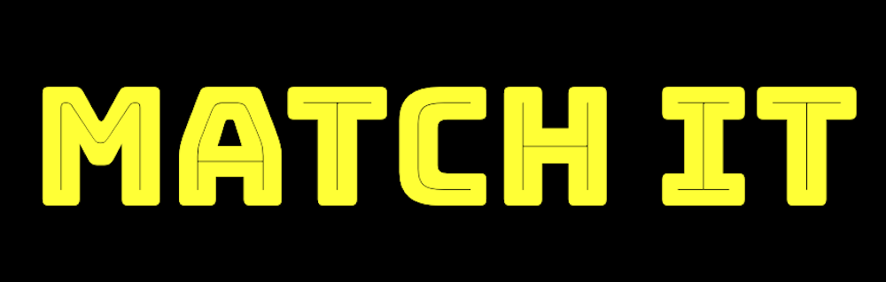

# Match It
View the live site [here](https://coderkatew.github.io/match-it/).

 

# Project Outline

3. [UX](#ux)

4. [Deployment](#deployment)

  

## UX   
### Who is this website for?
* People who wish to improve their memory skills
* People who wish to play a short online game that is easy to use
* Game creators who wish to showcase the games they have created  

### User Stories
1. As a player I want to play a game that involves using my memory so that I can improve my memory skills.
- This user can play the game in the Play section.

2. As a player, I want to know how playing memory games can improve memory skills.
- This user can find some information about the benefits of memory games for improving memory skills in the About section.

3. As a player I want to see my score so that I can see if I am making progress.
- This user can keep track of their score by watching the timer and turn count while they're playing the game, and see their final score on the feedback screen at the end of the game.

4. As a player I want a game that is intuitive and easy to use so that I can learn how to use it quickly.
- The structure of the site and game has been designed to include minimal elements on the page so that the game is the main focus, and there is a consistent experience throughout the first game and each replay game so that the user can quickly become familiar with how it works.

5. As a player I want a game that is quick to play and mobile-friendly so that I can play it on my smartphone during my commute.
- This user will see a mobile version of the game when they open it on their smartphone. The game time is 120 seconds so it can be completed in a very short amount of time and then replayed as often as the user wishes.

6. As the game creator and site owner, I want to build my subscriber list so that I can promote new games that I make.
- There is a form in the Subscribe section for users to submit their email address if they wish to hear about new games. The site owner can use this feature to build out their email list and share the site link publicly to gain new subscribers. Note:The form on the site is not currently set up to post the details submitted but I would like to include this in the next phase of the project.  

### Wireframes
The desktop and mobile wireframes for this project are located in the 'wireframe' folder:
* [Match It Wireframe](wireframe/match-it.pdf)
  

## Deployment
This project was developed in GitPod IDE, committed to git and pushed to GitHub.

The following steps were taken to deploy Match it to GitHub Pages from the GitHub repository:‰

* Log in to GitHub.
* Select coderkatew/match-it from the list of repositories.
* From the repository menu, select 'Settings'.
* Scroll down the 'Options' page (it opens on this page by default) to the 'GitHub Pages' section.
* Under 'Source' select 'master branch' from the drop-down menu.
* This updates the page and deploys the website.
* Scroll down to the GitHub Pages section again to view the link to the deployed website (https://coderkatew.github.io/match-it/). 
The Master Branch is the branch used for development of this project.  

To clone this Match It from GitHub to run it locally:
* Go to the Match It repository here: coderkatew/match-it
* Click on the green 'Clone' button under the repository menu.
* Copy the clone URL.
* Open your local IDE.
* Open the terminal and change the current working directory to the location where you want to store the cloned directory.
* Using 'git clone', paste the clone URL into the terminal and click the return key. 
This creates a local clone of the project.  